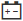

= 在 SANtricity System Manager 中檢視機櫃元件狀態和設定
:allow-uri-read: 
:experimental: 
:icons: font
:imagesdir: ../media/

[role="lead"]
硬體頁面提供機櫃組件的狀態和設定，包括電源供應器、風扇和電池。

.關於此任務
可用的元件取決於機櫃的類型：

* *磁碟機櫃* -- 在單一櫃體中包含一組磁碟機、電源 / 風扇罐、輸入 / 輸出模組（IOM）和其他支援元件。
* *控制器機櫃* -- 在單一機櫃中包含一組磁碟機、一個或兩個控制器匣、電源/風扇匣及其他支援元件。

.步驟
. 選擇 *Hardware* 。
. 選擇 Controller Shelf 或 Drive Shelf 的下拉列表，然後選擇 *View Settings* 。
+
「Shelf Components Settings」對話方塊隨即開啟，其中包含多個索引標籤，分別顯示與 shelf 元件相關的狀態和設定。根據所選 shelf 類型，表格中所述的某些索引標籤可能不會顯示。

+
[cols="25h,~"]
|===
| 標籤頁 | 說明 

 a| 
機櫃
 a| 
*Shelf* 標籤顯示以下屬性：

** *貨架 ID* -- 用於唯一標識儲存陣列中的一個貨架。控制器韌體會分配此編號，但您可以透過選擇功能表：貨架 [變更 ID] 來變更它。
** *機架路徑冗餘* -- 指定機架和控制器之間的連線是否具有備用方法（是）或沒有備用方法（否）。
** *目前硬碟類型* -- 顯示硬碟內建的技術類型（例如，具備安全功能的 SAS 硬碟）。如果存在多種硬碟類型，則會顯示所有技術。
** *序號* -- 顯示磁碟櫃的序號。

 a| 
IOM（ESM）
 a| 
*IOMs (ESMs)* 標籤顯示輸入 / 輸出模組（IOM）的狀態，該模組也稱為環境服務模組（ESM）。它監控磁碟機櫃中元件的狀態，並作為磁碟機匣和控制器之間的連接點。

狀態可以是 Optimal、Failed、Optimal (Miswire) 或 Uncertified。其他資訊包括韌體版本和組態設定版本。

選擇 *Show more settings* 以查看最大和當前資料速率以及卡片通訊狀態（是或否）。

[NOTE]
====
您也可以透過選擇 IOM 圖示image:../media/sam1130-ss-hardware-iom-icon.gif[""]（位於 Shelf 下拉清單旁邊）來查看此狀態。

====

 a| 
電源供應器
 a| 
*Power Supplies* 標籤顯示電源供應器外殼和電源供應器本身的狀態。狀態可以是 Optimal （最佳）、Failed （故障）、Removed （已移除）或 Unknown （未知）。此外，它還顯示電源供應器的零件編號。

[NOTE]
====
您也可以選擇「機架」下拉清單旁的「電源」圖示 image:../media/sam1130-ss-hardware-power-icon.gif[""] 來查看此狀態。

====

 a| 
風扇
 a| 
*風扇*標籤顯示風扇罩和風扇本身的狀態。狀態可以是最佳、故障、已移除或未知。

[NOTE]
====
您也可以選擇「書架」下拉清單旁的「Fan」圖示 image:../media/sam1130-ss-hardware-fan-icon.gif[""] 來查看此狀態。

====

 a| 
溫度
 a| 
*Temperature* 標籤顯示機櫃元件的溫度狀態，例如感測器、控制器和電源 / 風扇罐。狀態可以是 Optimal （最佳）、Nominal temperature exceeded （超過標稱溫度）、Maximum temperature exceeded （超過最高溫度）或 Unknown （未知）。

[NOTE]
====
您也可以透過選擇貨架下拉清單旁邊的「溫度」圖示 image:../media/sam1130-ss-hardware-temp-icon.gif[""] 來查看此狀態。

====

 a| 
電池
 a| 
*Batteries* 標籤顯示控制器電池的狀態。狀態包括：Optimal、Failed、Removed 或 Unknown。其他資訊包括電池使用年限、剩餘更換天數、學習週期數以及兩次學習週期之間的間隔週數。

[NOTE]
====
您也可以選擇「電池」圖示 （位於「貨架」下拉清單旁）來查看此狀態。

====

 a| 
SFP
 a| 
*SFPs* 標籤顯示控制器上小型可插拔（Small Form-factor Pluggable, SFP）收發器的狀態。狀態可以是 Optimal、Failed 或 Unknown。

選擇 *Show more settings* 以查看 SFP 的零件號碼、序號和供應商。

[NOTE]
====
您也可以透過選擇 SFP 圖示 image:../media/sam1130-ss-hardware-sfp-icon.gif[""]來查看此狀態，該圖示位於 Shelf 下拉清單旁。

====
|===
. 按一下 *Close* 。

