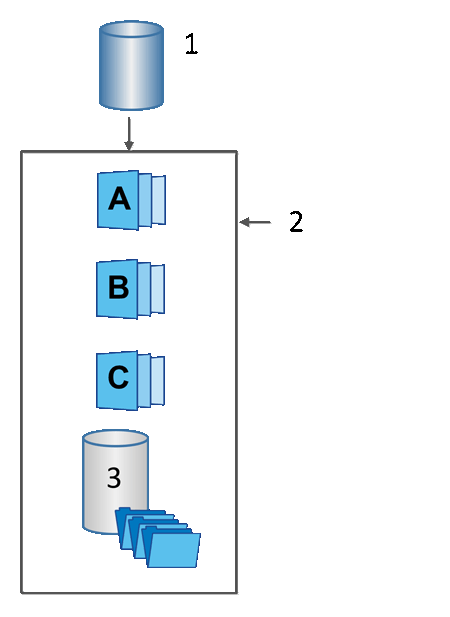

= 了解 SANtricity System Manager 中的基礎磁碟區、保留容量和快照群組
:allow-uri-read: 
:icons: font
:imagesdir: ../media/

[role="lead"]
Snapshots 功能利用基礎磁碟區、預留容量和快照群組。

== 基礎磁碟區

_基礎磁碟區_ 是指用作快照映像來源的磁碟區。基礎磁碟區可以是完整磁碟區或精簡磁碟區，並且可以位於儲存池或磁碟區群組中。

若要對基礎磁碟區進行快照、您可以隨時建立即時映像、也可以透過定義快照的定期排程來自動執行此程序。

下圖顯示快照物件與基礎磁碟區之間的關係。

^1^ 基本磁碟區；^2^ 群組中的快照物件（映像和保留容量）；^3^ 快照群組的保留容量。

== 保留容量和 Snapshot 群組

System Manager 將快照映像組織成_快照群組_。當 System Manager 建立快照群組時，它會自動建立關聯的_預留容量_，用於保存該群組的快照映像，並追蹤後續對其他快照的變更。

如果基礎磁碟區位於磁碟區群組中，則保留容量可以位於資源池或磁碟區群組中。如果基礎磁碟區位於資源池中，則保留容量必須與基礎磁碟區位於同一資源池中。

快照群組無需使用者操作，但您可以隨時調整快照群組的預留容量。此外，當滿足以下條件時，系統可能會提示您建立預留容量：

* 如果您對尚未建立快照群組的基礎磁碟區建立快照，System Manager 會自動建立快照群組。此操作也會為基礎磁碟區建立預留容量，用於儲存後續的快照映像。
* 無論何時為基礎磁碟區建立快照排程時， System Manager 都會自動建立快照群組。

== 自動刪除

使用快照時，請使用預設選項啟用自動刪除功能。自動刪除功能會在快照群組達到 32 個映像的快照群組限制時，自動刪除最舊的快照映像。如果關閉自動刪除功能，快照群組限制最終會超出，屆時您必須手動設定快照群組設定並管理保留容量。
