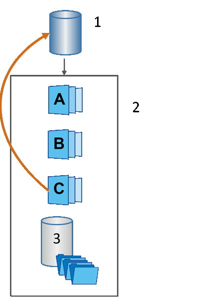

= 了解 SANtricity 軟體中的快照回溯功能
:allow-uri-read: 
:icons: font
:imagesdir: ../media/

[role="lead"]
復原作業會將基礎磁碟區還原至先前的狀態，該狀態由所選快照決定。

若要進行復原，您可以從下列任一來源選擇 Snapshot 映像：

* *Snapshot 映像回滾*，用於完全還原基礎磁碟區。
* *Snapshot 一致性群組回滾*，可用於回滾一個或多個磁碟區。

在回滾過程中，Snapshots 功能會保留群組中的所有快照映像。此外，如果需要執行 I/O 操作，它還允許主機在此過程中存取基礎磁碟區。

啟動回滾作業時，後台程序會遍歷基礎磁碟區的邏輯區塊位址 (LBA)，然後在回滾快照映像中尋找需要還原的寫時複製資料。由於基礎磁碟區對主機可進行讀寫操作，且所有先前寫入的資料都可立即使用，因此預留容量磁碟區必須足夠大，以容納回滾處理期間的所有變更。資料傳輸將持續作為背景操作進行，直到回滾完成。

^1^ 基本磁碟區；^2^ 群組中的 Snapshot 物件；^3^ Snapshot 群組保留容量
