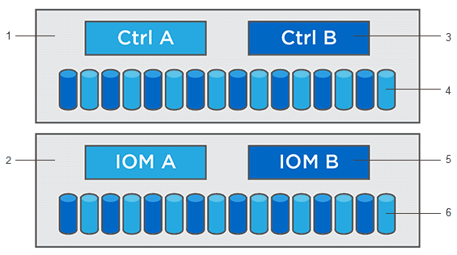

= 了解如何升級 SANtricity 軟體
:allow-uri-read: 
:experimental: 
:icons: font
:imagesdir: ../media/

[role="lead"]
使用 Upgrade Center 下載最新的軟體和韌體，並升級您的控制器和磁碟機。

== 控制器升級概述

您可以升級儲存陣列的軟體和韌體，以取得所有最新功能和錯誤修正。

=== OS 控制器升級中包含的元件

儲存陣列的多個元件包含軟體或硬體，您可能需要不時進行升級。

* *管理軟體* -- System Manager 是管理儲存陣列的軟體。
* *控制器韌體* -- 控制器韌體管理主機和磁碟區之間的 I/O 。
* *Controller NVSRAM* -- Controller NVSRAM 是一個控制器檔案，用於指定控制器的預設設定。
* *IOM 韌體* -- I/O 模組（IOM）韌體管理控制器和磁碟機櫃之間的連線。它也會監控元件的狀態。
* *Supervisor 軟體* -- Supervisor 軟體是控制器上的虛擬機器，軟體在該虛擬機器中執行。

^1^ 控制器機架；^2^ 磁碟機機架；^3^ 軟體、控制器韌體、控制器 NVSRAM、supervisor 軟體；^4^ 磁碟機韌體；^5^ IOM 韌體；^6^ 磁碟機韌體

您可以在「軟體和韌體清單」對話方塊中查看目前的軟體和韌體版本。前往功能表：Support [Upgrade Center]，然後按一下 *Software and Firmware Inventory* 連結。

作為升級過程的一部分，主機的多路徑/故障轉移驅動程式和/或 HBA 驅動程式可能也需要升級，以便主機能夠與控制器正確互動。若要確定是否需要升級，請參閱 https://imt.netapp.com/matrix/#welcome["NetApp Interoperability Matrix Tool"^]。

=== 何時停止 I/O

如果您的儲存陣列包含兩個控制器，並且您已安裝多路徑驅動程式，則儲存陣列可以在升級過程中繼續處理 I/O。升級期間，控制器 A 會將其所有磁碟區故障轉移到控制器 B、進行升級、收回其磁碟區以及控制器 B 的所有磁碟區，然後升級控制器 B。

=== 升級前健康狀況檢查

升級前健康狀況檢查會在升級程序中執行。升級前健康狀況檢查會評估所有儲存陣列元件，以確保升級可以繼續進行。下列情況可能會導致無法升級：

* 指派失敗的磁碟機
* 使用中的熱備援
* 不完整的磁碟區群組
* 執行獨佔作業
* 遺失的磁碟區
* 控制器處於非最佳狀態
* 事件記錄事件數量過多
* 組態資料庫驗證失敗
* 使用舊版 DACstore 的磁碟機

您也可以在不進行升級的情況下單獨執行升級前健全狀況檢查。

== 磁碟機升級總覽

硬碟韌體控制著硬碟的底層運作特性。硬碟製造商會定期發布硬碟韌體更新，以添加新功能、提升效能並修復缺陷。

=== 線上和離線磁碟機韌體升級

磁碟機韌體升級方法有兩種：線上和離線。

==== 線上

在線上升級過程中，硬碟會依序逐一升級。升級期間，儲存陣列會繼續處理 I/O。您無需停止 I/O。如果某個硬碟支援線上升級，系統會自動使用線上升級方式。

可執行線上升級的磁碟機包括以下項目：

* Optimal 資源池中的磁碟機
* Optimal 備援磁碟區群組（RAID 1、RAID 5 和 RAID 6）中的磁碟機
* 未指派的磁碟機
* 待命熱備援磁碟機

線上驅動器韌體升級可能需要幾個小時，這會使儲存陣列面臨潛在的磁碟區故障風險。磁碟區故障可能發生在以下情況：

* 在 RAID 1 或 RAID 5 磁碟區群組中，當磁碟區群組中的另一個磁碟機正在升級時，有一個磁碟機發生故障。
* 在 RAID 6 池或磁碟區群組中，當池或磁碟區群組中的另一個磁碟機正在升級時，有兩個磁碟機發生故障。

==== 離線（平行）

在離線升級過程中，所有相同類型的磁碟機將同時升級。此方法需要停止與所選磁碟機關聯的磁碟區的 I/O 活動。由於可以同時（並行）升級多個磁碟機，因此整體停機時間將顯著減少。如果某個磁碟機只能進行離線升級，則會自動使用離線升級方法。

以下磁碟機必須使用離線方法：

* 非冗餘磁碟區群組（RAID 0）中的磁碟機
* 非最佳資源池或磁碟區群組中的磁碟機
* SSD 快取中的磁碟機

=== 相容性

每個磁碟機韌體檔案都包含有關韌體執行所在磁碟機類型的資訊。您只能將指定的韌體檔案下載到相容的磁碟機。System Manager 會在升級過程中自動檢查相容性。
