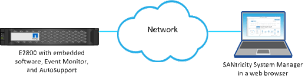

= 了解如何透過 Unified Manager 存取 SANtricity System Manager
:allow-uri-read: 
:icons: font
:imagesdir: ../media/

[role="lead"]
當您想要設定和管理儲存陣列時，您可以選擇一個或多個儲存陣列，然後使用「啟動」選項開啟 SANtricity System Manager。

System Manager 是控制器上的嵌入式應用程式，透過乙太網路管理連接埠連接到網路。它包含所有基於陣列的功能。

若要存取 System Manager ，您必須具備：

* 此處列出的其中一個陣列機型：link:https://docs.netapp.com/us-en/e-series/getting-started/learn-hardware-concept.html["E 系列硬體概述"^]
* 透過網頁瀏覽器與網路管理用戶端建立頻外連線。

